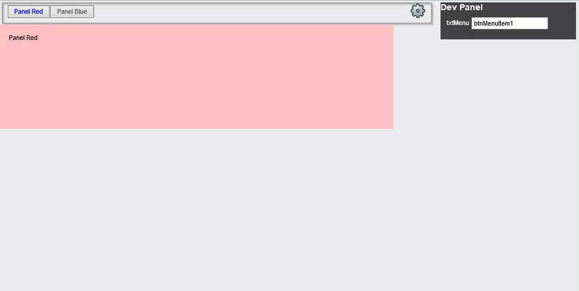
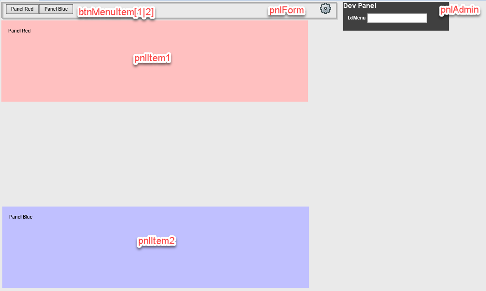

# Encompass: Input Form EZ Tabs
Simple methodology to create a tab system similar to the ATR QM form. 

## High Level 

 1. A button click assigns the desired panel name to a hidden control 
 1. The onChange event of that control loops through all controls on the form, hiding all but the desired panel and updating button colors
    1. An option exists to exempt panels like the admin panel shown
 1. All panel names and placement are handled dynamically preventing the need for code maintenance, just add new controls and name them correctly

## Low Level 
Consider a form with the following objects

### Button Clicks

A button click assisgs the name to the txtMenu control 

    txtMenu.Text = "btnMenuItem1"

*Tip: use the same line of code on formOpen to set a default tab*

## txtMenu Change

The txtMenu onChange event runs the following

~~~
'############Dynamic Menu######################################
'How to Use: 
'   name buttons btnMenuXXXX 
'   name panels pnl[XXXX from btMenu name]
'   btnMenuXXXX onClick event = txtMenu.Text = "[btnMenuXXXX]"
'Collect the buttons in the panel and loop
Dim btMenu As New System.Collections.Generic.List(Of Button)()
Dim pnPanel as New System.Collections.Generic.List(Of Panel)()
'Integer offsets for dynamic panel placement
Dim x as integer
Dim y as integer
x=0
y=40
'Defaults for colors
Dim cActive
Dim cInactive
cActive = System.Drawing.Color.FromArgb(0, 0, 240)
cInactive = System.Drawing.Color.FromArgb(90, 90, 90)
'Create a list of Panels
For Each c as Control In Me.Controls()
	If TypeOf c is Panel Then 
		pnPanel.Add(c)
	End if 
Next
'Create a list of Buttons
For Each c As Control In pnlForm.Controls()
	If TypeOf c Is Button Then
		btMenu.Add(c)
	End If
Next
'Loop all panels and hide (exempts listed)
For each p as Panel in pnPanel
	'Hide all but exclusion(s) list
	If p.ControlID <> "pnlAdmin" AND _
	  p.ControlID <> "pnlMenu" AND _
	  p.ControlID <> "pnlForm" Then
		p.visible = False
	End If 
Next
'Now Loop all buttons and compare to the value
' of the unbound menu control to determine what was clicked
For Each b As Button in btMenu 
	'Set inactive color (all)
	b.ForeColor = cInactive
	'Match the entry and act
	If b.ControlID = txtMenu.Text then
		'Set to active color (clicked)
		b.ForeColor = cActive
		'Find the correct panel make visible and locate dynamically
		For Each p as Panel in pnPanel
			If Mid(b.ControlID,8) = Mid(p.ControlID,4) Then
				'Set the position to defaults and make vis
				p.Position = New Point(x,y)
				p.visible = True
			End If
		Next
	End If
Next
'############Dynamic Menu######################################

~~~

